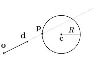
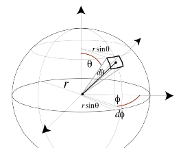
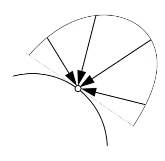
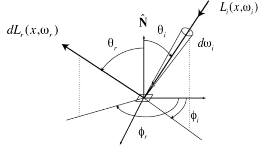

# 光线追踪

光栅方案缺陷

1. 全局效果不佳,光线多次弹射的场景：
   - soft shadows
   - glossy reflection
   - indirect illumination
2. 光栅化速度快，效果较差：

---

## whitted-style ray tracing,根据关线弹射.计算所有点颜色合并

前置假设条件：

1. 光沿着直线传播
2. 光线不会碰撞
3. 光线从光源发射经过 反射/折射 进入人眼,配合 光路可逆性 可以从人眼出发开始计算

---

Ray: $r(t)=o+td,0\le t<\infin$
光线会随着距离的边长而衰减

General implicit surface(隐式表面): p:$f(p)=0$

Substitute ray equation:$f(o+td)=0$

### 隐式表面与光线

1. 圆与光线
   
   Sphere:$p:(p-c)^2-R^2=0$

点 p 在光线与圆上:
$$(o+td-c)^2-R^2=0$$

### 三角形与光线

思路:

1. 求光线与平面交点
2. 交点是否在平面内

Moller Trumbore Algorithm 算法,快速计算交点

如果计算像素颜色时,需要和每个三角形计算交点后,找到最近的三角形交点表示该像素颜色.
速度缓慢.

#### 加速计算的方法

使用 Bounding Volumes 排除物体, Axis-Aligned Bounding Box(AABB)
二维下

1. 光线与盒子 X 轴 中间线 A
2. 光线与盒子 Y 轴 中间线 B
3. 线 A 与线 B 求交集,如果有交集,就进入过盒子,没有交集,未进入过盒子

数学上理解为$t_{enter}<t_{exit} $并且$t\_{exit}>0$

---

Uniform grid

1. 找出场景包围盒,均分成格子,
2. 标记有物体的格子(有物体表面会与光线相交)
3. 按照光线方向,一个个格子找过去

适用于分布均匀的场景

---

Spatial Partitions

使用数据结构划分空间

- Oct-Tree
- KD-Tree
- BSP-Tree

##### kd-tree

空间划分,盒子没有交集,物体会在多个盒子

1. 数据结构
   internal node store 中间节点
   - split axis:x- ,y- or z-axios
   - split position: coordinate of split plane along axis
   - children: pointers to child nodes
     Leaf node store 叶子节点,存放数据
   - list of objects
2. Traversing a KD-Tree
   1. 先于最大包围盒判断相交,如果相交遍历所有子节点
      1. 如果与子节点包围盒相交,继续遍历下面的节点
      2. 如果是叶节点,判断所有与物体的交点

##### bvh

物体划分,包围盒有交集,物体只会在一个包围盒中

1. Bounding Volume Hierarchy(BVH) 包围盒间存在重叠
   - 平均划分,保证树平衡(快速选择算法,找中间点)
   - 选择最长的轴划分
2. 数据结构
   - internal nodes store
     - bounding box
     - children: pointers to child nodes
   - Leaf nodes store
     - bounding box
     - list of object
   - Nodes represent subset of primitives in scene
     - all object in subtree
3. Traversal

   ```txt
   Intersect (Ray ray,BVH node){
      if (ray misses node.bbox) return;

      if(node is a left node){
         test tersection with all objs;
         return closest intersection;
      }

      hit1 = Intersect(ray, node.child2);
      hit2 = Intersect(ray, node.child2)

      return the closer of hit1, hit2;
   }
   ```

## Basic radiometry(辐射度量学)

定义了描述光照的方法与单位

实际描述空间中的光线

- Radiant flux
- intensity
- irradiance
- radian

描述再物理学上正确的光照

### radiant energy 电子辐射能量

$Q[J=Joule]$

### radiant flex

radiant flex (power) 单位时间的能量(功率) $$\Phi=\frac{dQ}{dt}[W = Watt][lm = lumen]^*$$

### Rediant intensity

Light Measurements of Interest

Radiant Intensity($I$): thr power per **unit solid angle** emitted by a point light source.

单位立体角上,发射出去的能量:$I(\omega)=\frac{d\Phi}{d\omega}$

---

推导过程：
立体角根据弧度公式推导到三维: $\Omega = \frac{A}{r^2}$,球总角度$4\pi$

$$[\frac{W}{sr}][\frac{lm}{sr}=cd=candela]$$

点全部方向散发出的总能量:
$$\Phi=\int_{s2}Id\omega=4\pi I$$
$$I = \frac{\Phi}{4\pi}$$

Differential Solid Angles(微分立体角)
$$dA=(rd\theta)(r sin\theta d\phi)=r^2 sin\theta d\theta d\phi$$
$$d\omega=\frac{dA}{r^2}=sin\theta d\theta d\phi$$


### Irradiance



每个单位面积上接收到的能量,如果光与表面不垂直,接收到的能量就是投影在法线方向的能量

$$E(x)=\frac{d\Phi(x)}{dA}$$
$$[\frac{W}{m^2}][\frac{lm}{m^2}=lux]$$

### Radiance

power per unit solid angle pre projected unit area

$$L(p,\omega) = \frac{d^2 \Phi(p,w)}{d\omega dA cos\theta} $$

$$[\frac{W}{srm^2}][\frac{cd}{m^2}=\frac{lm}{srm^2}=nit]$$

从两个方向考虑:

1. 入射 Radiance,一个单位面接收到的能量是从四面八方来的,从单位方向射入到单位面上的能量就是

   $$L(p,\omega)=\frac{dE(p)}{d\omega cos\theta}$$

2. 发射 Radiance,一个单位面辐射出去的单位角度能量
   $$L(p,\omega)=\frac{dI(p,\omega)}{dA cos\theta}$$

note: $cos\theta$ 光到面上的能量,面只接受法线方向的能量.

### Irradiance vs Radiance


- Irradiance: dA 接收到的所有能量
- Radiance: dA 从某个$d\omega$接受到的能量

$$dE(p,\omega)=L_i(p,\omega)cos\theta d\omega$$
$$E(p)=\int_{H^2}L_i(p,\omega)cos\theta d\omega$$

### Bidirectional Reflectance Distribution Function(BRDF)



1. 某立体角$d\omega$入射光会让$dA$获取到能量$dE_i(\omega_{i})$
   $$dE(\omega_i)=L(\omega_i) cos\theta_i d\omega_i$$
2. $dA$接收到的能量$dE(\omega_i)$对某个立体角$d\omega$发射出去的能量$dL_r(\omega_r)$
   $$f_r(\omega_i \to \omega_r)=\frac{dL_r(\omega_r)}{dE_i(\omega_i)}=\frac{dL_r(\omega_r)}{L_i(\omega_i)cos\theta_i d\omega_i} \left[\frac{1}{sr}\right]$$

   镜面放射可以视为,固定角度有值,其余角度为0,
   漫反射,各个角度都有值

把每个方向的入射光汇聚到出射方向

$$L_r(p,\omega_r)=\int_{H^2}f_r(p,\omega_i \to \omega_r)L_i(p,\omega_i) cos\theta_i d\omega_i$$

### Rendering Equation

物体对外的发光 = 自发光 + 反射的光

$$L_o(p,\omega_o) = L_e(p,\omega_o) + \int_{\Omega^+}L_i(p,\omega_i)f_r(p,\omega_i,\omega_o)(n \cdot \omega_i)d\omega_i$$

### Reflection Equation

[link](https://www.bilibili.com/video/BV1X7411F744?p=15) 47:06

## path tracing
