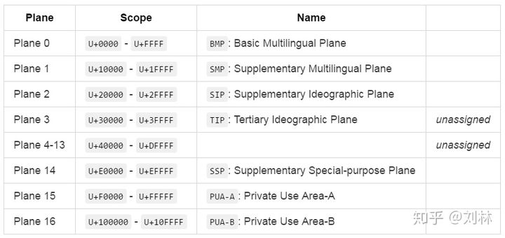
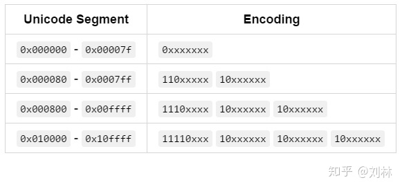
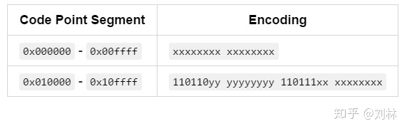
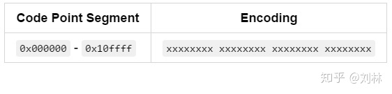

# 字符

1. ASCII 任何一个letter(字母), digits(数字), and symbols(符号) 在 32 ~ 127 内表示
   > 计算机大多使用8位一个字节,每个字节都有足够的长度容纳一个符号

2. Unicode 每一个字符在该系统内有一个code-point,
   比如ع 字符,code-point:U+00639,U表示Unicode,数字是hex(十六进制)的
   > 因为后面计算机不止被英语国家所使用,需要加入其它国家的语言,所以人们在128~255上搞事情,混乱的发展让一个数字可能表示多种符号,为了统一,提出了unicode  

   
   该图规定了Unicode范围对应的字符类型

3. utf8与utf16 code-point如何存储与读取
   1. utf8 用1个字节表示基本平面BMP字符
   
   1. utf16 用2个字节表示基本平面BMP字符
   
   3. utf32 用4个字节表示基本平面BMP字符
   
   可以看出utf8相对于utf16,在0x000800开始,会更消耗空间
   汉字通常位于 0x000800 - 0x00ffff,吃空间的时候到了

## 编程语言

1. utf8: rust,golang
2. utf16: java,JavaScript
3. 直接表示: html
   - 十进制： &#9658; &#33333;
   - 十六进制： &#x25ba; &#x8235;

### nodejs

使用 utf-16 来进行编码

表示:
'\u00E9'

对于 4 个以上的十六进制  
Unicode code point escapes："\u{1F4A9}"  
use surrogate pairs：'\uD83D\uDCA9'(不推荐使用)

1. 将代码点转换为符号:
   ECMAScript 6 引入了 String.fromCodePoint(codePoint)可正确处理星体符号的功能

```js
String.fromCodePoint(0x1F4A9)
'💩' // U+1F4A9
```

2. 从字符串中获取代符号

```js
>> '💩'.at(0) // U+1F4A9
'💩' // U+1F4A9
```

3. 从字符串中获取代码点

```js
>> '💩'.codePointAt(0)
0x1F4A9
```

&#x1F4A9;

参考文献：

1. [javascript-unicode](https://mathiasbynens.be/notes/javascript-unicode)

## 二进制数据与读取方式结果

文本信息会根据编码被存为0101

比如以utf8 存储 abcdefg六六六

1. utf8
abcdefg六六六
2. 二进制数据
61 62 63 64 65 66 67 E5 85 AD E5 85 AD E5 85 AD
3. utf16-le
扡摣晥궅藥궅
4. utf16-be
慢捤敦查薭귥薭

# base64

| Index   | Binary | Char | Index | Binary | Char | Index | Binary | Char | Index | Binary | Char |
| ------- | ------ | ---- | ----- | ------ | ---- | ----- | ------ | ---- | ----- | ------ | ---- |
| 0       | 000000 | A    | 16    | 010000 | Q    | 32    | 100000 | g    | 48    | 110000 | w    |
| 1       | 000001 | B    | 17    | 010001 | R    | 33    | 100001 | h    | 49    | 110001 | x    |
| 2       | 000010 | C    | 18    | 010010 | S    | 34    | 100010 | i    | 50    | 110010 | y    |
| 3       | 000011 | D    | 19    | 010011 | T    | 35    | 100011 | j    | 51    | 110011 | z    |
| 4       | 000100 | E    | 20    | 010100 | U    | 36    | 100100 | k    | 52    | 110100 | 0    |
| 5       | 000101 | F    | 21    | 010101 | V    | 37    | 100101 | l    | 53    | 110101 | 1    |
| 6       | 000110 | G    | 22    | 010110 | W    | 38    | 100110 | m    | 54    | 110110 | 2    |
| 7       | 000111 | H    | 23    | 010111 | X    | 39    | 100111 | n    | 55    | 110111 | 3    |
| 8       | 001000 | I    | 24    | 011000 | Y    | 40    | 101000 | o    | 56    | 111000 | 4    |
| 9       | 001001 | J    | 25    | 011001 | Z    | 41    | 101001 | p    | 57    | 111001 | 5    |
| 10      | 001010 | K    | 26    | 011010 | a    | 42    | 101010 | q    | 58    | 111010 | 6    |
| 11      | 001011 | L    | 27    | 011011 | b    | 43    | 101011 | r    | 59    | 111011 | 7    |
| 12      | 001100 | M    | 28    | 011100 | c    | 44    | 101100 | s    | 60    | 111100 | 8    |
| 13      | 001101 | N    | 29    | 011101 | d    | 45    | 101101 | t    | 61    | 111101 | 9    |
| 14      | 001110 | O    | 30    | 011110 | e    | 46    | 101110 | u    | 62    | 111110 | +    |
| 15      | 001111 | P    | 31    | 011111 | f    | 47    | 101111 | v    | 63    | 111111 | /    |
| padding | =      |

规则:字符的八进制 ASCLL,三个一组分给 4 个 6 位字符,高位补充 00

例子:

```
字符:abc
ASCLL:01100001,01100010,01100011
base64:00011000,00010110,00001001,00100011
按照上表转换
字符:YWJj
```

# hex

十六进制,就是不经过转换直接输出 ASCLL 码

比如 a

1. 字符a
2. &#x61;
3. unicode U+61
4. hex 61

# latin1

# emoji

表情图标 😋

单 unicode 由 U+1xxxx 组成，相较于基础的 Unicode，最高位多了个 1,归于plane16,自定义符号的范围
