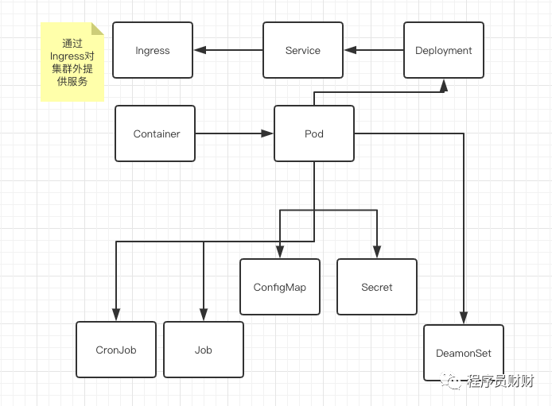

# k8s

## 基础概念

1. container 单独运行的容器
2. Pod 负责管理容器的网络栈,存储卷等,同一个pod内的容器可以共享很多信息,可以通过localhost访问.
3. ConfigMap 存储配置信息,Secret存储敏感信息(常用Etcd),Pod启动的时候加载其中的数据
4. DeamonSet 守护进程,可以运行监控,日志等任务
5. Deployment 管理Pod,负责扩容,容灾等操作
6. Service ,整合Deployment分裂的Pod,对内提供服务,可以通过`<Service Name>.<NameSpace>`的形式访问Pod提供的服务
7. Ingress 对外提供服务,可以做负载均衡、自动签发Https证书、限流等功能

---

namespace: 把一个K8S集群划分为若干个资源不可共享的虚拟集群而诞生的。
